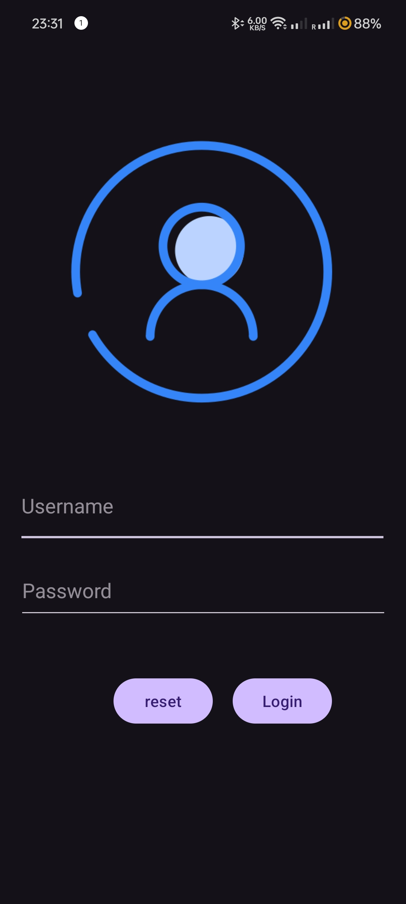
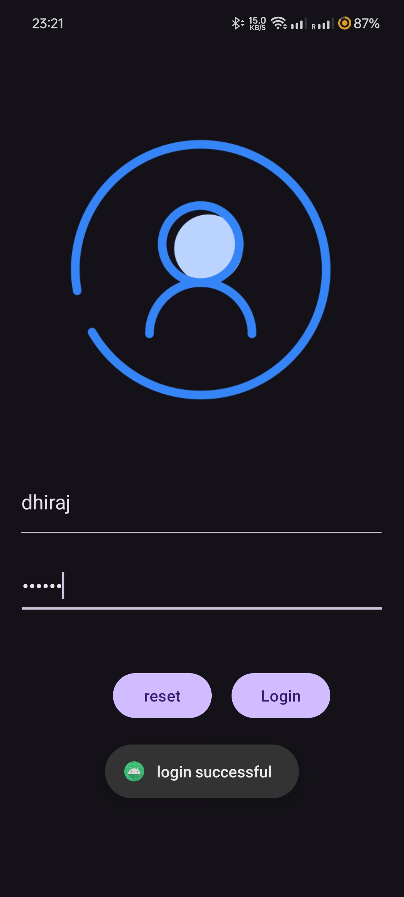

# Login Page in Android Studio with Kotlin

This repository contains a simple login page created using Kotlin in Android Studio. The project demonstrates basic user authentication with hardcoded credentials and includes features such as reset functionality and UI elements. 

## Features

- **Username and Password Input:** Allows users to enter their username and password.
- **Login Button:** Validates the credentials and displays a success or failure message.
- **Reset Button:** Clears the input fields.
- **Responsive Layout:** Adjusts to different screen sizes with padding to avoid overlaps with system bars.

## Screenshots

### Login Screen


### Login Successful


### Login Unsuccessful


## Getting Started

Follow these instructions to get a copy of the project up and running on your local machine.

### Prerequisites

- Android Studio 4.1 or later
- Kotlin 1.4 or later

### Installation

1. Clone the repository:
    ```bash
    git clone https://github.com/tbhhero/Login_In_Android_Studio_Kotlin.git
    ```
2. Open the project in Android Studio.
3. Build the project by selecting `Build > Make Project` or pressing `Ctrl+F9`.
4. Run the project on an emulator or physical device by selecting `Run > Run 'app'` or pressing `Shift+F10`.

## Contributing

Feel free to submit issues or pull requests for improvements and fixes.

## License

This project is licensed under the MIT License - see the [LICENSE](LICENSE) file for details.

## Acknowledgments

- Icons from [iconfinder](https://www.iconfinder.com/)

## Contact

For any questions or comments, please open an issue or reach out to the repository owner(TBHHERO-ME).

---

**Repository Link:** [Login In Android Studio Kotlin](https://github.com/tbhhero/Login_In_Android_Studio_Kotlin.git)
